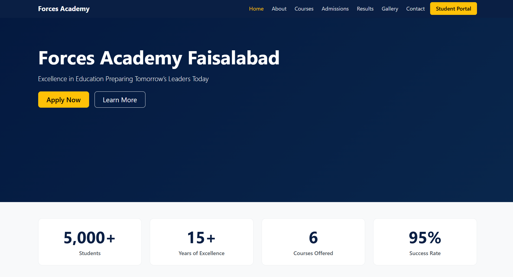
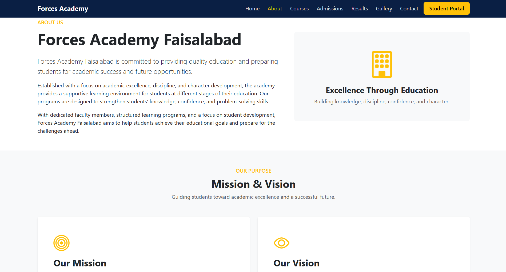
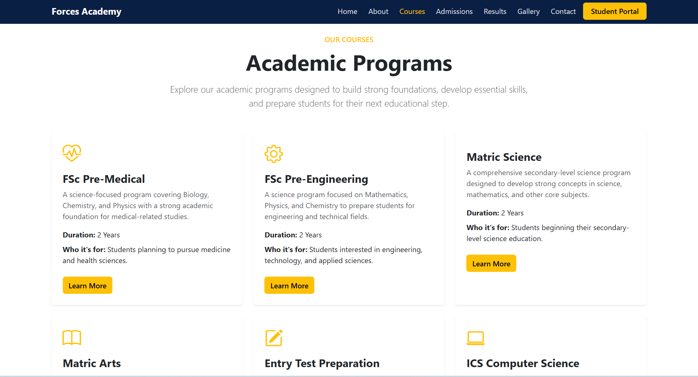

# Forces Academy — Final Frontend Project | Code Saviours SI-26

## Project Description

Forces Academy Faisalabad is a responsive seven-page frontend website developed as part of the **Code Saviours SI-26 Frontend Track internship**.

The website provides information about the academy, courses, admissions, student results, gallery, and contact details. It focuses on responsive design, consistent UI, and JavaScript interactivity.

## Live Site

[Visit the Live Website](https://hamzaahmad-dev.github.io/forces-academy-frontend-codesaviours-si26-hamza/)

## Screenshots

### Home Page

### About Page

### Courses Page

## Tech Stack

* HTML5
* CSS3
* Bootstrap 5.3.3
* JavaScript
* Bootstrap Icons
* Git & GitHub
* GitHub Pages

## Features

* Responsive seven-page website
* Responsive Bootstrap navbar and consistent footer
* Active page navigation
* Distinct Student Portal button
* Academy information and leadership section
* Course and admissions information
* Student results table
* Gallery with category filtering and GLightbox
* Contact form with JavaScript validation
* Google Maps integration
* Animated statistics counter using Intersection Observer API
* Student testimonials carousel with autoplay and controls
* Smooth scrolling
* Back to Top button
* Responsive design for mobile, tablet, and desktop

## Built By

**Hamza Ahmad | Code Saviours SI-26 | 2026**
